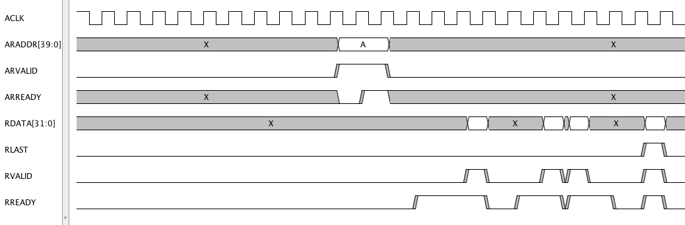

AXI Burst Read 
===============

Save the following script as axi_burst_read.py ::

    # start a new file 
    if taApp.getFileName() != "axi_burst_read.tim":
        taApp.fileNew("TimingDiagram")
    
    # td is the current TimingDiagram Frame 
    td = taApp.getTimingDiagram()
    
    aclk    = td.addDigitalClock("ACLK", "H", 100.0e6)
    aclk.setRiseTime(0.0)
    aclk.setFallTime(0.0)
    
    araddr  = td.addDigitalBus("ARADDR[39:0]", "X", "Hex")
    arvalid = td.addDigitalSignal("ARVALID", "L")
    arready = td.addDigitalSignal("ARREADY", "X") 
    rdata   = td.addDigitalBus("RDATA[31:0]", "X", "Text")
    rlast   = td.addDigitalSignal("RLAST", "L") 
    rvalid  = td.addDigitalSignal("RVALID", "L") 
    rready  = td.addDigitalSignal("RREADY", "L") 
    
    td.addEdge(araddr, 103.0e-9, "A")
    td.addEdge(araddr, 123.0e-9, "X")
    
    td.addEdge(arvalid, 102.0e-9, 103.0e-9, "H")
    td.addEdge(arvalid, 122.0e-9, 123.0e-9, "L")
    
    td.addEdge(arready, 103.0e-9, "L")
    td.addEdge(arready, 112.0e-9, 113.0e-9, "H")
    td.addEdge(arready, 123.0e-9, "X")
    
    td.addEdge(rdata, 154.0e-9, "D(A0)")
    td.addEdge(rdata, 162.0e-9, "X")
    td.addEdge(rdata, 184.0e-9, "D(A1)")
    td.addEdge(rdata, 192.0e-9, "X")
    td.addEdge(rdata, 194.0e-9, "D(A2)")
    td.addEdge(rdata, 202.0e-9, "X")
    td.addEdge(rdata, 224.0e-9, "D(A3)")
    td.addEdge(rdata, 232.0e-9, "X")
    
    td.addEdge(rlast, 223.0e-9, 224.0e-9, "H")
    td.addEdge(rlast, 231.0e-9, 232.0e-9, "L")
    
    td.addEdge(rvalid, 153.0e-9, 154.0e-9, "H")
    td.addEdge(rvalid, 161.0e-9, 162.0e-9, "L")
    td.addEdge(rvalid, 183.0e-9, 184.0e-9, "H")
    td.addEdge(rvalid, 191.0e-9, 192.0e-9, "L")
    td.addEdge(rvalid, 193.0e-9, 194.0e-9, "H")
    td.addEdge(rvalid, 201.0e-9, 202.0e-9, "L")
    td.addEdge(rvalid, 223.0e-9, 224.0e-9, "H")
    td.addEdge(rvalid, 231.0e-9, 232.0e-9, "L")
    
    
    td.addEdge(rready, 133.0e-9, 134.0e-9, "H")
    td.addEdge(rready, 161.0e-9, 162.0e-9, "L")
    td.addEdge(rready, 173.0e-9, 174.0e-9, "H")
    td.addEdge(rready, 191.0e-9, 192.0e-9, "L")
    td.addEdge(rready, 193.0e-9, 194.0e-9, "H")
    td.addEdge(rready, 211.0e-9, 212.0e-9, "L")
    td.addEdge(rready, 223.0e-9, 224.0e-9, "H")
    td.addEdge(rready, 231.0e-9, 232.0e-9, "L")
    
    td.setEndTime(300.0e-9)
    td.doAnalysisCommand("margins")

