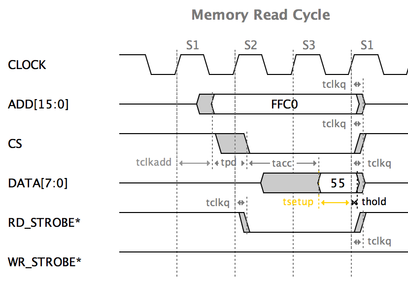

.. _contents:

The TimingAnalyzer
==================

Using the TimingAnalyzer, you can quickly draw timing diagrams and build
libraries of timing diagrams. Using the built-in analysis functions, you
can quickly find speed related design issues since setup and hold
violations are detected, reported, and shown in the diagrams.

You can draw the diagrams using the GUI or Python scripts.  Timing diagrams
can be created automatically from simulation VCD files so they can be 
annotated and used in documenation. Application notes included in the 
documentation desribe how to create Verilog or VHDL monitors that 
automatically generate timing diagrams. 

**SOME NEW CHANGES COMING IN BETA 0.980 SOON**

A new app note, **"Intro to Timing Analysis"**,  is included in the
Documenation section. It describes how to analyze setup and hold paths with
clock jitter and clock skew and much more. Included scripts can be used as is,
or modified to analyze any user defined paths.     

  * New timing engine with accuracy to 1x10-15 seconds
  * Added jitter margins
  * Delays can show min or max annotations
  * Web site moved to ReadTheDocs format

The new documentation can also be viewed and printed in various formats at:

  * `This Web Site <http://web-site.readthedocs.org>`_.
  * `Reference <http://ref-manula.readthedocs.org>`_.
  * `Scripting <http://scripting-manual.readthedocs.org>`_.
  * `Generating Timing Diagrams from Verilog and VHDL Simulations <http://app-notes.readthedocs.org>`_.
  * `Introduction to Timing Analysis <http://intro-timing-analysis.readthedocs.org>`_.

.. toctree::
   :maxdepth: 1
   :hidden:

   features
   latest_news
   screenshots_and_videos
   getting_started
   step_by_step_examples
   documentation
   timing_diagram_library
   download
   faq
   google_group
   contact
   license
   
