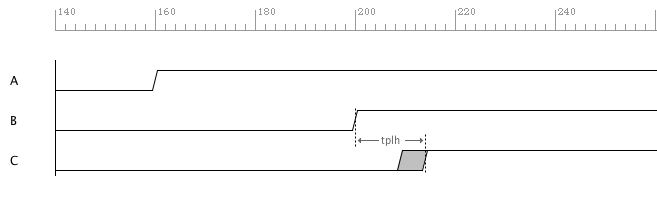

Combinatorial Logic
=====================

The truth tables shown below describes the operation of the AND, OR, and INVERTER logic gates. These are examples of combinatorial logic functions since the outputs are only dependent on the present state of the inputs.    

+---------------+---------+--------+---------+
| Inputs        |          Outputs           |
+===============+=========+========+=========+
|   A   |   B   |   AND   |   OR   |  INV A  |
+---------------+---------+--------+---------+
|   0   |   0   |    0    |    0   |    1    |
+---------------+---------+--------+---------+
|   0   |   1   |    0    |    1   |    1    |
+---------------+---------+--------+---------+
|   1   |   0   |    0    |    1   |    0    |
+---------------+---------+--------+---------+
|   1   |   1   |    1    |    1   |    0    |
+---------------+---------+--------+---------+

Propagation Delay
------------------

The propagation delay of the logic gate specifies how long it takes the output to change after the inputs changed. This delay is defined the manufacturer of the part and can actually be specified as two delays.  :math:`t_{plh}` indicates the delay when the output is changing from a 0 to 1, and :math:`t_{phl}` indicates the delay when the output is changing from a 1 to 0.    

* :math:`t_{plh}` Low to High Output Propagation Delay
* :math:`t_{phl}` High to Low Output Propagation Delay

Example Problem.

  Given.
    *  :math:`t_{plh}` = 9ns minimum and 14ns maximum
    *  :math:`t_{phl}` = 8ns minimum and 13ns maximum
    *  A = 1 and B = 0 and C = 0 @ t = 100ns
    *  A = 1 and B = 1 @ t = 200ns

  At what time will the AND gate output C change to a 1? 
  
  Answer:  :math:`t_{plhmax} + 200ns = 14ns + 200ns = 214ns`

  Considering minimum and maximum delays are specified, the output could actually change
  between 200ns + 9ns and 200ns +14ns.  This is called the delay margin.

   Propagation Delay of Combinatorial AND Gate.

.. code-block:: python
   :linenos:

   if "new.tim" != taApp.getFileName():
       taApp.fileNew("TimingDiagram")
   
   td = taApp.getTimingDiagram()
   td.startScript()
   
   ain  = td.add_digital_signal("A","L")
   bin  = td.add_digital_signal("B","L")
   cout = td.add_digital_signal("C","L")
     
   a_e1 = td.add_edge(ain,160,"H")
   b_e1 = td.add_edge(bin,200,"H")
   c_e1 = td.add_edge(cout,200,"H")
   
   tplh  = td.add_part_delay("tplh", 9, 11, 14, "AND Gate Prop Delay")
   td.add_delay(tplh,b_e1,c_e1)
   
   td.stopScript()

