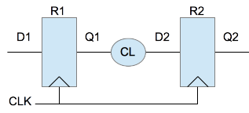
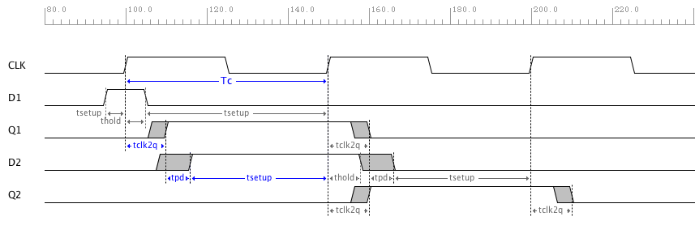
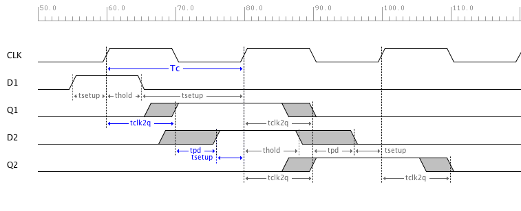
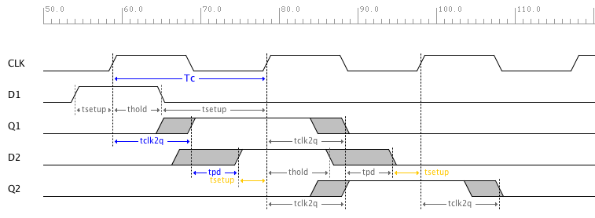

Register to Register Path 
========================

   Register to Register Logic Diagram

The diagram above shows the timing path to be analyzed.   R1 is the source register, R2 is the 
destination register, and CL is a combinatorial logic block.

Setup Analysis
---------------

   Register to Register Timing Diagram with Clock Frequency at 20MHz

The list below shows the delays and constraints that need to be considered for setup analysis of the path from register 1 to register 2.  

  - R1 Clock-to-Q Delay Maximum :math:`t_{clk2q}`
  - CL Propagation Delay Maximum :math:`t_{pd}`
  - R2 Setup Constraint Minimum :math:`t_{setup}`
  - Tc The Clock Period Minimum  :math:`T_c`

.. math::
   :label: reg_2_reg_clk_min

   T_c &\geq t_{clk2q} + t_{pd} + t_{setup} \\
       &\geq 10ns + 6ns + 4ns \\
       &\geq 20ns

:math:`T_c` is the minimum clock period and the maximum clock frequency can be calculate using :math:`1/T_c` 

.. math::
   :label: reg_2_reg_freq_max

   f_{CLK} &\leq 1/T_c \\
           &\leq 1/20ns \\
           &\leq 50MHz

.. code-block:: python
   :linenos:

   if "new.tim" != taApp.getFileName():
       taApp.fileNew("TimingDiagram")
   
   td = taApp.getTimingDiagram()
   td.startScript()
   
   clk2q = td.add_part_delay("tclk2q", 6, 8, 10, "DFF Clock to Q Output Delay")
   pd    = td.add_part_delay("tpd", 2, 4, 6, "Combinatorial Logic Delay")
   setup = td.add_part_constraint("tsetup", 4, 4, "DFF Setup Constraint")
   hold  = td.add_part_constraint("thold", 2, 2, "DFF Hold Constraint")
   
   clk = td.add_digital_clock("CLK","H",20.0e6)
   clk_e4 = clk.get_edge_list().get(6)
   clk_e6 = clk.get_edge_list().get(8)
   pwl = td.add_pulse_width_label(clk_e4, clk_e6, "Tc", "Center")
   
   d1  = td.add_digital_signal("D1","L")
   d1_e1 = td.add_edge(d1, 55, "H")
   d1_e2 = td.add_edge(d1, 65, "L")
   
   q1 = add_dff_re(td, d1, clk, 'Q1', setup, hold, clk2q)
   d2 = add_comb_logic(td, q1, "D2", pd )
   q2 = add_dff_re(td, d2, clk, 'Q2', setup, hold, clk2q)
   
   td.stopScript()

The script above was used to draw the the timing diagram above. The CLK frequency is initially set to 20MHz in line 12 and the flip-flops setup time is set to 4ns on line 9. In this case with 20MHz CLK frequency, the actual setup time is much more than the required setup time as shown in the timing diagram above. 

The maximum clock frequency was calculated to be 50MHz above.  The timing diagram below shows no constraint violations when CLK frequency is set to 50MHz.  

   Register to Register Setup Analysis with Clock Frequency at 50MHz

If the clock frequency is set to 51MHz, setup time violations on R2 occur indicating the maximum clock frequency was exceeded for this circuit.  See the timing diagram below.

   Register to Register Setup Analysis with Clock Frequency at 51MHz

Hold Analysis
--------------

The list below shows the delays and constraints that need to be considered for hold analysis of the path from register 1 to register 2.  

  - R1 Clock-to-Q Delay Minimum :math:`t_{clk2q}`
  - CL Propagation Delay Minimum :math:`t_{pd}`
  - R2 Hold Constraint Minimum :math:`t_{hold}`

.. math::
   :label: reg_2_reg_hold

   t_{clk2q} + t_{pd} &\geq t_{hold} \\
            6ns + 2ns &\geq 2ns \\
                  8ns &\geq 2ns

Many flip-flops today are designed with 0ns hold time so they can be connected together and tclk2q will guarantee meeting the hold time constraint. 

If the flip-flops being used require hold time greater than 0,  then the sum of the min delays in the path must be greater must be greater than the required hold time.  If not, then hold time violations occur and the circuit will not operate reliably.  Sometime buffers are added in the path to guarantee the sum of the delays is greater than the hold time.

