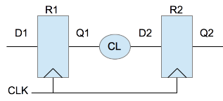

Register to Register Path with Clock Jitter
=============================================

   Register to Register Path Analysis for Clock Jitter

The diagram above shows the timing path used previously for the simple register to register path analysis. This time we will assume the CLK source is a PLL or oscillator output and variations in cycle times occur. Clock edge times can vary from the ideal rising edge time, :math:`edge time + cycle time`, by a value specified by the manufacturer commonly called Period Jitter. 

 
Setup Analysis
---------------

The timing diagram below shows the CLK1 with Jitter added to the rising edges.  Without Jitter, the edges would occur at 100ns and 150ns, the ideal rising edge times. With Jitter, the rising edges occur at :math:`100ns \pm 1ns` and :math:`150ns \pm 1ns`.

   Register to Register Path Setup Analysis with Clock Skew 

The list below shows the delays and constraints that need to be considered for setup analysis of the path from register 1 to register 2.  

  - R1 Clock-to-Q Delay Maximum :math:`t_{clk2q}`
  - CL Propagation Delay Maximum :math:`t_{pd}`
  - R2 Setup Constraint Minimum :math:`t_{setup}`
  - Clock Skew :math:`t_{skew}`
  - Tc The Clock Period Minimum  :math:`T_c`

.. math::
   :label: reg_2_reg_clk_min

   T_c &\geq t_{clk2q} + t_{pd} + t_{setup} + t_{skew} \\
       &\geq 10ns + 6ns + 4ns + 5ns \\
       &\geq 25ns

:math:`T_c` is the minimum clock period and the maximum clock frequency can be calculate using :math:`1/T_c` 

.. math::
   :label: reg_2_reg_freq_max

   f_{CLK} &\leq 1/T_c \\
           &\leq 1/25ns \\
           &\leq 40MHz

.. code-block:: python
   :linenos:

   from ta_py_lib.td.logic import *
   
   if "new.tim" != taApp.getFileName():
       taApp.fileNew("TimingDiagram")
   
   td = taApp.getTimingDiagram()
   td.startScript()
   
   jm    = td.add_jitter_margin("tjitter", 1, 1, "Example Clock Jitter")
   clk2q = td.add_part_delay("tclk2q", 6, 8, 10, "DFF Clock to Q Output Delay")
   pd    = td.add_part_delay("tpd", 2, 4, 6, "Combinatorial Logic Delay")
   setup = td.add_part_constraint("tsetup", 4, 4, "DFF Setup Constraint")
   hold  = td.add_part_constraint("thold", 2, 2, "DFF Hold Constraint")
      
   clk = td.add_digital_clock("CLK","H",20.0e6)
   clk_e4 = clk.get_edge_list().get(4)
   clk_e6 = clk.get_edge_list().get(6)
   clk_e4.add_jitter_margin(jm)
   clk_e6.add_jitter_margin(jm)
   pwl = td.add_pulse_width_label(clk_e4, clk_e6, "Tc", "Center")
   
   d1  = td.add_digital_signal("D1","L")
   d1_e1 = d1.add_edge(95, "H")
   d1_e2 = d1.add_edge(105, "L")
   
   q1 = add_dff_re(td, d1, clk, 'Q1', setup, hold, clk2q)
   d2 = add_comb_logic(td, q1, "D2", pd )
   q2 = add_dff_re(td, d2, clk, 'Q2', setup, hold, clk2q)
   
   td.stopScript()

Hold Analysis
--------------

The timing diagram below shows the minimum :math:`t_{clk2q}` and :math:`t_{pd}` are used for hold time analysis.  

   Register to Register Path Hold Analysis with Clock Skew 

The list below shows the delays and constraints that need to be considered for hold analysis of the path from register 1 to register 2.  

  - R1 Clock-to-Q Delay Minimum :math:`t_{clk2q}`
  - CL Propagation Delay Minimum :math:`t_{pd}`
  - R2 Hold Constraint Maximum :math:`t_{hold}`
  - Clock Skew :math:`t_{skew}`

.. math::
   :label: reg_2_reg_hold_voilation

   t_{hold}  &< t_{clk2q} + t_{pd} \\
         2ns &< 6ns + 2ns \\
         2ns &< 8ns

