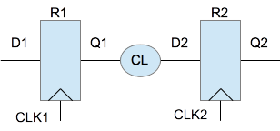
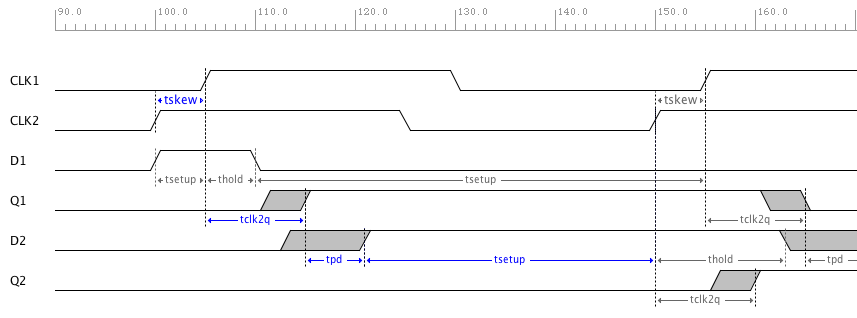
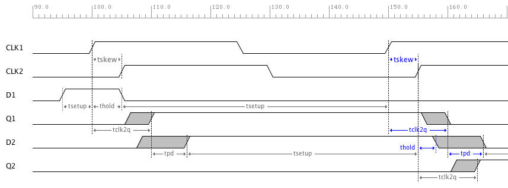

Register to Register Path with Clock Skew
===========================================

   Register to Register Path with Clock Skew

The diagram above shows the timing path to be analyzed.   R1 is the source register, R2 is the 
destination register, and CL is a combinatorial logic block. CLK1 is used by R1,  and CLK2 by R2,  but both originate from the same source output.  In real circuits, these clock signals will not reach the flip-flops at the same time. Wire or net delays, clock gates, and clock tree outputs produce this variation in time called **Clock Skew**.

 
Setup Analysis
---------------

The timing diagram below shows the case when CLK2 leads CLK1, but we should also consider the case when CLK2 lags CLK1 and use worst case setup analysis.  

   Register to Register Path Setup Analysis with Clock Skew 

The list below shows the delays and constraints that need to be considered for setup analysis of the path from register 1 to register 2.  

  - R1 Clock-to-Q Delay Maximum :math:`t_{clk2q}`
  - CL Propagation Delay Maximum :math:`t_{pd}`
  - R2 Setup Constraint Minimum :math:`t_{setup}`
  - Clock Skew :math:`t_{skew}`
  - Tc The Clock Period Minimum  :math:`T_c`

.. math::
   :label: reg_2_reg_clk_min

   T_c &\geq t_{clk2q} + t_{pd} + t_{setup} + t_{skew} \\
       &\geq 10ns + 6ns + 4ns + 5ns\\
       &\geq 25ns

:math:`T_c` is the minimum clock period and the maximum clock frequency can be calculate using :math:`1/T_c` 

.. math::
   :label: reg_2_reg_freq_max

   f_{CLK} &\leq 1/T_c \\
           &\leq 1/25ns \\
           &\leq 40MHz

.. code-block:: python
   :linenos:

   from ta_py_lib.td.logic import *
   
   if "new.tim" != taApp.getFileName():
       taApp.fileNew("TimingDiagram")
   
   td = taApp.getTimingDiagram()
   td.startScript()
   
   clk2q = td.add_part_delay("tclk2q", 6, 8, 10, "DFF Clock to Q Output Delay")
   pd    = td.add_part_delay("tpd", 2, 4, 6, "Combinatorial Logic Delay")
   setup = td.add_part_constraint("tsetup", 4, 4, "DFF Setup Constraint")
   hold  = td.add_part_constraint("thold", 2, 2, "DFF Hold Constraint")
   
   clk1 = td.add_digital_clock("CLK1","H",20.0e6)
   clk1.set_start_delay(5)
    
   clk1_e4 = clk1.get_edge_list().get(4)
   clk1_e6 = clk1.get_edge_list().get(6)
    
   clk2 = td.add_digital_clock("CLK2","H",20.0e6)
   clk2_e4 = clk2.get_edge_list().get(4)
   clk2_e6 = clk2.get_edge_list().get(6)
    
   td.add_pulse_width_label(clk2_e4, clk1_e4, "tskew", "Center")
   td.add_pulse_width_label(clk2_e6, clk1_e6, "tskew", "Center")
    
   d1 = td.add_digital_signal("D1","L")
   d1_e1 = d1.add_edge(100, "H")
   d1_e2 = d1.add_edge(110, "L")
    
   q1 = add_dff_re(td, d1, clk1, 'Q1', setup, hold, clk2q)
   d2 = add_comb_logic(td, q1, "D2", pd )
   q2 = add_dff_re(td, d2, clk2, 'Q2', setup, hold, clk2q)
  
   td.stopScript()

The script above sets the frequency to 20MHz for both CLK1 and CLK2 in lines 14 and 20. The delay added in line 15 to CLK1 represents the clock skew of 5ns in this example.  In the examples following, we will use the "add_skew" clock method using only 1 clock to perform the same analysis.    

The maximum clock frequency is calculated above to be 40MHz above :eq:`reg_2_reg_freq_max`.  In the example shown previously without clock skew, :doc:`reg_2_reg`, the maximum clock frequency was calculated to be 50MHz.  Increasing clock skew decreases the maximum operational frequency.  

Hold Analysis
--------------

   Register to Register Path Hold Analysis with Clock Skew 

The list below shows the delays and constraints that need to be considered for hold analysis of the path from register 1 to register 2.  

  - R1 Clock-to-Q Delay Minimum :math:`t_{clk2q}`
  - CL Propagation Delay Minimum :math:`t_{pd}`
  - R2 Hold Constraint Maximum :math:`t_{hold}`
  - Clock Skew :math:`t_{skew}`

.. math::
   :label: reg_2_reg_hold

   t_{clk2q} + t_{pd} &\geq t_{hold} + t_{skew} \\
            6ns + 2ns &\geq 2ns + 5ns \\
                  8ns &\geq 7ns

As you can see from the equations above,  the addition of clock skew requires an increased sum of the minimum :math:`t_{clk2q}` plus the minimum :math:`t_{pd}` as compared to the hold analysis example without skew show previously in :doc:`reg_2_reg`. If we remove the combinatorial logic delay and connect 2 flip-flops back to back, the hold time constraint would not be met. 

.. math::
   :label: reg_2_reg_hold_voilation

   t_{clk2q}  &\geq t_{hold} + t_{skew} \\
          6ns &\ngeq 2ns + 5ns\\
          6ns &\ngeq 7ns

.. code-block:: python
   :linenos:

   from ta_py_lib.td.logic import *
   
   if "new.tim" != taApp.getFileName():
       taApp.fileNew("TimingDiagram")
   
   td = taApp.getTimingDiagram()
   td.startScript()
   
   clk2q = td.addPartDelay("tclk2q", 6, 8, 10, "DFF Clock to Q Output Delay")
   pd    = td.addPartDelay("tpd", 2, 4, 6, "Combinatorial Logic Delay")
   setup = td.addPartConstraint("tsetup", 4, 4, "DFF Setup Constraint")
   hold  = td.addPartConstraint("thold", 2, 2, "DFF Hold Constraint")
   
   clk1 = td.addDigitalClock("CLK1","H",20.0e6)
   clk1_e4 = clk1.getEdgeList().get(4)
   clk1_e6 = clk1.getEdgeList().get(6)
   
   clk2 = td.addDigitalClock("CLK2","H",20.0e6)
   clk2.setStartDelay(5)
   clk2_e4 = clk2.getEdgeList().get(4)
   clk2_e6 = clk2.getEdgeList().get(6)
   
   td.addPulseWidthLabel(clk2_e4, clk1_e4, "tskew", "Center")
   td.addPulseWidthLabel(clk2_e6, clk1_e6, "tskew", "Center")
   
   d1   = td.addDigitalSignal("D1","L")
   d1_e1 = d1.addEdge(95, "H")
   d1_e2 = d1.addEdge(105, "L")
   
   q1 = add_dff_re(td, d1, clk1, 'Q1', setup, hold, clk2q)
   d2 = add_comb_logic(td, q1, "D2", pd )
   q2 = add_dff_re(td, d2, clk2, 'Q2', setup, hold, clk2q)
   
   td.stopScript()

