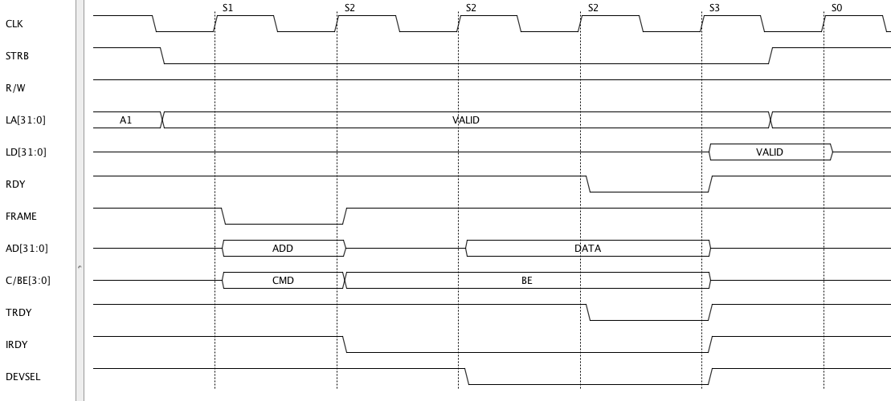

PCI IO Read 
===============

Save the following script as pci_io_read.py ::

    taApp.fileNew("TimingDiagram")
    td = taApp.getTimingDiagram()
     
    clk_freq = 33.0e6
    clk_per  = 1.0/clk_freq
     
    clk     = td.addDigitalClock("CLK", "H", clk_freq)
    strb    = td.addDigitalSignal("STRB", "H")
    r_w     = td.addDigitalSignal("R/W", "H")
    la      = td.addDigitalBus("LA[31:0]", "A1", "Text")
    ld      = td.addDigitalBus("LD[31:0]", "Z", "Text")
    rdy     = td.addDigitalSignal("RDY", "H")
    frame   = td.addDigitalSignal("FRAME", "H") 
    ad      = td.addDigitalBus("AD[31:0]", "Z", "Text")
    c_be    = td.addDigitalBus("C/BE[3:0]", "Z", "Text")
    trdy    = td.addDigitalSignal("TRDY", "H") 
    irdy    = td.addDigitalSignal("IRDY", "H") 
    devsel  = td.addDigitalSignal("DEVSEL", "H") 
     
     
    def add_edges(clk_cycle):
       fe_time = (clk_cycle*clk_per) + (clk_per/2.0) + 2.0e-9
       re_time = clk_cycle*clk_per + 2.0e-9
       if clk_cycle == 0:
           td.addEdge(strb,fe_time, "L")
           td.addEdge(la,  fe_time, "VALID")
       elif clk_cycle == 1:
           td.addEdge(frame,re_time, "L")
           td.addEdge(ad,re_time, "ADD")
           td.addEdge(c_be,re_time, "CMD")
       elif clk_cycle == 2:
           td.addEdge(frame,re_time, "H")
           td.addEdge(ad,re_time, "Z")
           td.addEdge(c_be,re_time, "BE")
           td.addEdge(irdy,re_time, "L")
       elif clk_cycle == 3:
           td.addEdge(ad,re_time, "DATA")
           td.addEdge(devsel,re_time, "L")
       elif clk_cycle == 4:
           td.addEdge(rdy,re_time, "L")
           td.addEdge(trdy,re_time, "L")
       elif clk_cycle == 5:
           td.addEdge(strb,fe_time, "H")
           td.addEdge(la,fe_time, "A1")
           td.addEdge(ld,re_time, "VALID")
           td.addEdge(rdy,re_time, "H")
           td.addEdge(ad,re_time, "Z")
           td.addEdge(c_be,re_time, "Z")
           td.addEdge(trdy,re_time, "H")
           td.addEdge(irdy,re_time, "H")
           td.addEdge(devsel,re_time, "H")
       elif clk_cycle == 6:
           td.addEdge(ld,re_time, "Z")
     
    for clk_cycle in range (0,7):
        add_edges(clk_cycle)
     
    state_list = ['NU','S1','S2','S2','S2','S3','S0']
     
    clk_cycle = 0
    for clk_edge in clk.getEdgeList():
        if clk_cycle == 7:
            break
        if clk_edge.getNextState() == "H":
            td.addStateBar(clk_edge,state_list[clk_cycle],"Dashed",0,0)
            clk_cycle+=1
     
    td.setEndTime(300.0e-9)

