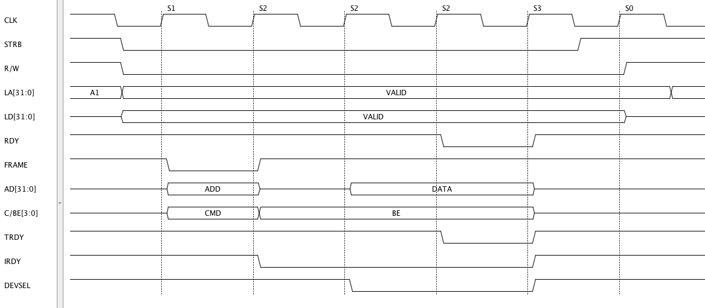

PCI IO Write 
===============

Save the following script as pci_io_write.py ::

    from ta_py_lib.ta.app import *
    from ta_py_lib.td.logic import *
    from ta_py_lib.td.commands import *
     
    td = new_timing_diagram(taApp)
    start_script(td)
    
    clk_freq = 33.0e6
    clk_per  = 1.0e9 / clk_freq
    
    clk     = add_digital_clock(td, "CLK", "H", clk_freq)
    strb    = add_digital_signal(td, "STRB", "H")
    r_w     = add_digital_signal(td, "R/W", "H")
    la      = add_digital_bus(td, "LA[31:0]", "A1", "Text")
    ld      = add_digital_bus(td, "LD[31:0]", "Z", "Text")
    rdy     = add_digital_signal(td, "RDY", "H")
    frame   = add_digital_signal(td, "FRAME", "H")
    ad      = add_digital_bus(td, "AD[31:0]", "Z", "Text")
    c_be    = add_digital_bus(td, "C/BE[3:0]", "Z", "Text")
    trdy    = add_digital_signal(td, "TRDY", "H")
    irdy    = add_digital_signal(td, "IRDY", "H")
    devsel  = add_digital_signal(td, "DEVSEL", "H")
    
    
    def add_edges(clk_cycle):
       fe_time = (clk_cycle * clk_per) + (clk_per / 2.0) + 2.0
       re_time = clk_cycle * clk_per + 2.0
       if clk_cycle == 0:
           add_edge(strb, fe_time, "L")
           add_edge(la, fe_time, "VALID")
           add_edge(ld, fe_time, "VALID")
           add_edge(r_w, fe_time, "L")
       elif clk_cycle == 1:
           add_edge(frame, re_time, "L")
           add_edge(ad, re_time, "ADD")
           add_edge(c_be, re_time, "CMD")
       elif clk_cycle == 2:
           add_edge(frame, re_time, "H")
           add_edge(ad, re_time, "Z")
           add_edge(c_be, re_time, "BE")
           add_edge(irdy, re_time, "L")
       elif clk_cycle == 3:
           add_edge(ad, re_time, "DATA")
           add_edge(devsel, re_time, "L")
       elif clk_cycle == 4:
           add_edge(rdy, re_time, "L")
           add_edge(trdy, re_time, "L")
       elif clk_cycle == 5:
           add_edge(strb, fe_time, "H")
           add_edge(rdy, re_time, "H")
           add_edge(ad, re_time, "Z")
           add_edge(c_be, re_time, "Z")
           add_edge(trdy, re_time, "H")
           add_edge(irdy, re_time, "H")
           add_edge(devsel, re_time, "H")
       elif clk_cycle == 6:
           add_edge(r_w, re_time, "H")
           add_edge(ld, re_time, "Z")
           add_edge(la, fe_time, "A1")
    
    for clk_cycle in range (0,7):
        add_edges(clk_cycle)
    
    state_list = ['NU','S1','S2','S2','S2','S3','S0']
    
    clk_cycle = 0
    for clk_edge in get_edge_list(clk):
        if clk_cycle == 7:
            break
        if get_next_state(clk_edge) == "H":
            add_statebar(td, clk_edge, state_list[clk_cycle], "Dashed", 0, 0)
            clk_cycle+=1
    
    set_end_time(td, 300)
    stop_script(td)

 

