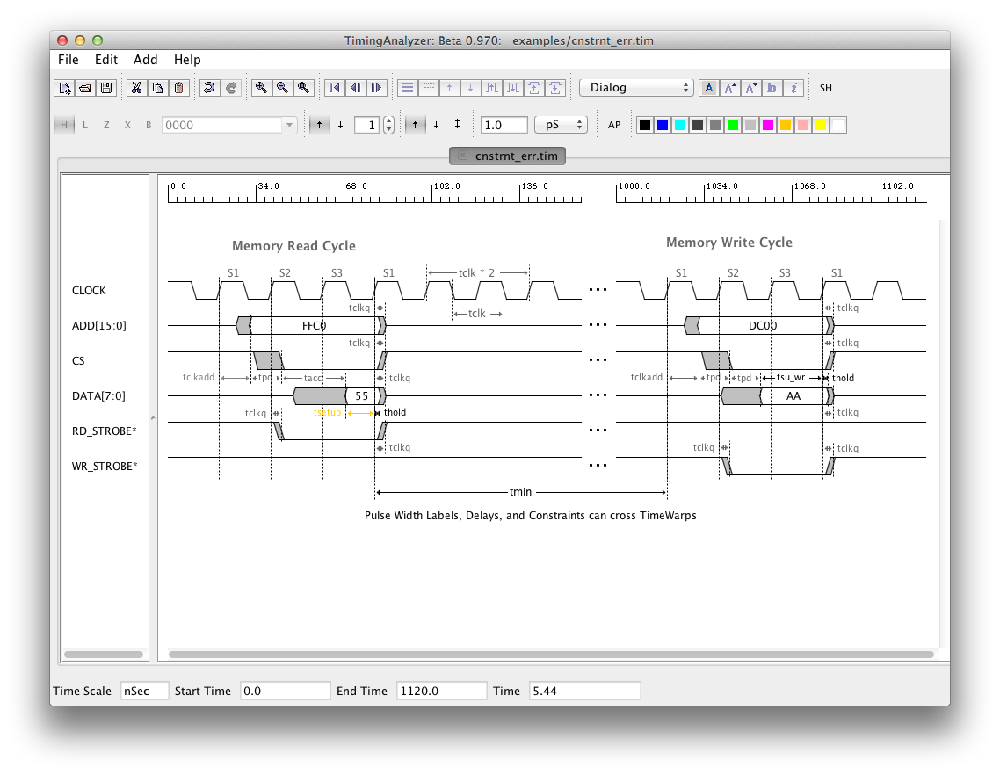

Screenshots and Videos 
======================

Moving Transactions Synchronously
---------------------------------

Moving transactions synchronously can make life much easier when you have add 
signal changes or transactions to an existing timing diagram. For example, if
you decide to add a read cycle in between two write cycles you would need to
move the 2nd write cycle to the right by maybe 10 clock cycles. This is done
with synchronous moves. Simply select the 2nd write cycle by dragging the
mouse around the transaction, then use Alt and Right Key combination to move it.  

See the video shown below to see an example.

`Move Synchronoulsy Video <http://www.timing-diagrams.com/move_sync.avi>`_.

