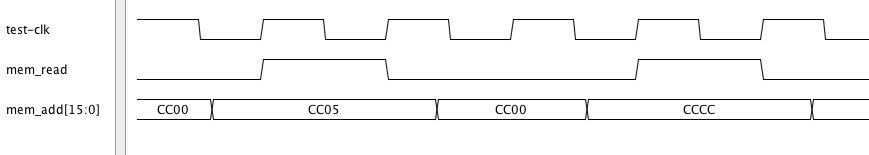
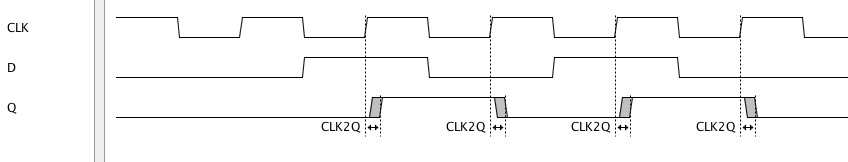

Script Examples 
=================================

.. highlight:: python
   :linenothreshold: 5

 
Drawing a Timing Diagram
^^^^^^^^^^^^^^^^^^^^^^^^^^^  

                                       
The script draw_diagram.py is shown below ::

    from ta_py_lib.ta.app import *
    from ta_py_lib.td.logic import *
    from ta_py_lib.td.commands import *
    
    td = new_timing_diagram(taApp)
    start_script(td)
    
    dclock  = add_digital_clock(td, "test-clk", "H", 20.0e6)
    dsignal = add_digital_signal(td, "mem_read", "L")
    dbus    = add_digital_bus(td, "mem_add[15:0]", "CC00", "Hex")
    
    add_pulse(dsignal, 50.0, 100.0, "H")
    add_pulse(dbus, 30.0, 120.0, "CC05")
    
    add_edge(dsignal, 200.0, "H")
    add_edge(dsignal, 250.0, "L")
    
    add_edge(dbus, 180.0, "CCCC")
    add_edge(dbus, 270.0, "CD00")
    
    stop_script(td)

                                                
Creating a D Flip Flop   
^^^^^^^^^^^^^^^^^^^^^^^^^^^

The script dff.py is shown below ::

    from ta_py_lib.ta.app import *
    from ta_py_lib.td.logic import *
    from ta_py_lib.td.commands import *
    
    td = new_timing_diagram(taApp)
    start_script(td)
    
    clk  = add_digital_clock(td, "CLK","H",20.0e6)
    sigD = add_digital_signal(td, "D","L")
    sigQ = add_digital_signal(td, "Q","L")
      
    add_pulse(sigD, 75.0, 125.0, "H")
    add_edge(sigD, 175.0, "H")
    add_edge(sigD, 225.0, "L")
    
    dly_min       = 2
    dly_typ       = 4
    dly_max       = 6
    clk2q_dly     = add_part_delay(td, "CLK2Q", dly_min, dly_typ, dly_max, "DFF Clock to Q Output Delay")
    clk_edge_list = get_edge_list(clk)
    
    ls = "L"  
    for clk_edge in clk_edge_list:
        if get_next_state(clk_edge) == "H":
            et = get_pt2_min(clk_edge)
            ns = get_state_at_time(sigD, et)
            #print "edge time %d next state %s" % (et,ns)
            if ((ns != ls) and (et + dly_min > get_last_edge_pt2(sigQ))):
                sigQ_edge = add_edge(sigQ, et, ns)
                add_delay(td, clk2q_dly,clk_edge,sigQ_edge)
            ls = ns
              
    stop_script(td)

            

Dumping Signal Values
^^^^^^^^^^^^^^^^^^^^^^^

The script dump_edges.py is shown below ::
                                                          
    from org.dmad.ta import DigitalClock
    from ta_py_lib.ta.app import *
    from ta_py_lib.td.logic import *
    from ta_py_lib.td.commands import *
    from ta_py_lib.td.utils import *
    
    td = get_timing_diagram(taApp)
    start_script(td)
    
    out_file = set_output_file("dump_edges.txt")
    
    signal_list = get_signal_list(td)
    
    clock_signal = None
    for signal in signal_list:
        if isinstance(signal, DigitalClock):
            clock_signal = signal
        else:
            out_file.write("%s " % (get_name(signal)))
    
    out_file.write("\n")
    
    for clock_edge in get_edge_list(clock_signal):
        if get_next_state(clock_edge) == "H":
            edge_time = get_pt2_min(clock_edge)
            for sig in signal_list:
                if sig != clock_signal:
                    out_file.write("%s " % (get_state_at_time(sig, edge_time)))
            out_file.write("\n")
    
    out_file.close()
    
    stop_script(td)

An example output from dump_edges.py  ::                       
                       
    D Q D_diff mem_read mem_add[15:0] 
    H L L H L CC00 
    H L L H H CC05 
    H H L L L CC05 
    H L H H L CC00 
    H H L L H CCCC 
    H L H H L CCCC 
    H L L H L CD00 

Generating VHDL Test Vectors
^^^^^^^^^^^^^^^^^^^^^^^^^^^^^^^^

The script vhdl_test_vectors.py is shown below ::

    from org.dmad.ta import DigitalSignal
    from org.dmad.ta import DigitalBus
    from org.dmad.ta import DigitalClock
    
    from ta_py_lib.ta.app import *
    from ta_py_lib.td.logic import *
    from ta_py_lib.td.commands import *
    from ta_py_lib.td.utils import *
    
    out_file = set_output_file("vhdl_test_vectors.txt")
    td       = get_timing_diagram(taApp)
    
    start_script(td)
    
    ts       = get_time_scale(td)
    ts_text  = get_time_scale_text(ts)
    signals  = get_signal_list(td)
    
    for sig in signals:
        i = 0
    
        out_file.write("%s <= " % (get_name(sig)))
    
        for edge in get_edge_list(sig):
            if isinstance(sig, DigitalSignal) or isinstance(sig, DigitalClock):
                line = "'%s'"  % (get_next_state(edge))
                if i != 0:
                    line = "    %s after %s %s" % (line, edge.getPt2Min() / 1000, ts_text)
            elif isinstance(sig, DigitalBus):
                state_format = {
                    "Hex":  "X\"",
                    "Bin":  "\""
                }
    
                sStart = state_format[get_state_format(sig)]
    
                line = "%s%s\"" % (sStart, get_next_state(edge))
                if i != 0:
                    line = "    %s after %s %s" % (line, edge.getPt2Min() / 1000, ts_text)
                        
            if ( i == len(get_edge_list(sig))-1):
                out_file.write("%s;\n\n" % (line))
            else:
                out_file.write("%s,\n" % (line))
    
            i += 1
    out_file.close()
    stop_script(td)

An example output from vhdl_test_vectors.py  ::                       
                
    ADD[15:0] <= X"Z",
        X"FFC0" after 27.0 ns,
        X"Z" after 82.0 ns,
        X"DC00" after 1027.0 ns,
        X"Z" after 1082.0 ns;
    
    CS <= 'H',
        'L' after 34.0 ns,
        'H' after 82.0 ns,
        'L' after 1034.0 ns,
        'H' after 1082.0 ns;
    
    DATA[7:0] <= X"Z",
        X"55" after 49.0 ns,
        X"Z" after 82.0 ns,
        X"AA" after 1041.0 ns,
        X"Z" after 1082.0 ns;

Generating SPICE PWL Test Vectors
^^^^^^^^^^^^^^^^^^^^^^^^^^^^^^^^

The script spice_pwl_test_vectors.py is shown below ::

    from org.dmad.ta import DigitalBus
    from ta_py_lib.ta.app import *
    from ta_py_lib.td.logic import *
    from ta_py_lib.td.commands import *
    from ta_py_lib.td.utils import *
    
    td = get_timing_diagram(taApp)
    start_script(td)
    
    ts       = get_time_scale(td)
    out_file = set_output_file('spice_pwl_test_vectors_py.txt')
    
    sig_list = get_signal_list(td)
    for sig in sig_list:
        if not isinstance(sig, DigitalBus):
            out_file.write("%s N1 N2 PWL (\n" % (get_name(sig)))
            out_file.write("    0.0 %s\n"  % (get_voltage(get_start_state(sig)))) 
    
            ed_list = get_edge_list(sig)
            i = 0
            for ed in ed_list:
                if i > 0:
                    ls_voltage = get_voltage(get_last_state(ed))
                    ns_voltage = get_voltage(get_next_state(ed))
                    out_file.write("    %f%s %s\n" % (get_pt1_min(ed) / 1000.0, get_ts_text(ts), ls_voltage))
                    out_file.write("    %f%s %s\n" % (get_pt3_min(ed) / 1000.0, get_ts_text(ts), ns_voltage))
                i += 1
            out_file.write("    %f%s %s\n" % (get_end_time(td), get_ts_text(ts), ns_voltage))
            out_file.write("    )\n")
        else:
            num_bits     = get_num_bits(sig)
            state_format = get_state_format(sig)
            
            ls_bit = get_ls_bit(get_name(sig))
            ms_bit = get_ms_bit(get_name(sig))
            
            for i in range(ls_bit,ms_bit+1):
                start_state = get_start_state(sig);
                if (state_format != "Bin"):
                    start_state = convert_format(start_state,state_format,"Bin",num_bits)
                    
                bus_name = get_name(sig)
                bus_name = bus_name[0:bus_name.find("[")]
                out_file.write("%s[%d] N1 N2 PWL (\n" % (bus_name,i))
    
                if (start_state == "Z"):
                    ss_voltage = get_voltage("Z")
                else:
                    ss_voltage = get_voltage(start_state[i])
    
                out_file.write("    0.0 %s\n" % (ss_voltage))
               
                ed_list = get_edge_list(sig)
                j = 0
                for ed in ed_list:
                    if (j > 0):
                        last_state = get_last_state(ed)
                        if (state_format != "Bin"):
                            last_state = convert_format(last_state,state_format,"Bin",num_bits) 
                        if (last_state == "Z"):
                            ls_voltage = get_voltage("Z")
                        else:
                            ls_voltage = get_voltage(last_state[ms_bit-i])
    
                        next_state = get_next_state(ed)
                        if (state_format != "Bin"):
                            next_state = convert_format(next_state,state_format,"Bin",num_bits) 
                        if (next_state == "Z"):
                            ns_voltage = get_voltage("Z")
                        else:
                            ns_voltage = get_voltage(next_state[ms_bit-i])
    
                        out_file.write("    %f%s %s\n" % (get_pt1_min(ed) / 1000, get_ts_text(ts), ls_voltage))
                        out_file.write("    %f%s %s\n" % (get_pt3_min(ed) / 1000, get_ts_text(ts), ns_voltage))
                    j += 1
                end_voltage = ns_voltage
                out_file.write("    %f%s %s\n" % (get_end_time(td), get_ts_text(ts), end_voltage))
                out_file.write("    )\n")
    
    out_file.close()
    stop_script(td)

An example output from spice_pwl_test_vectors.py  ::                       

    ADD[1] N1 N2 PWL (
        0.0 2.5
        26.500000e-9 2.5
        27.500000e-9 0.0
        81.500000e-9 0.0
        82.500000e-9 2.5
        1026.500000e-9 2.5
        1027.500000e-9 0.0
        1081.500000e-9 0.0
        1082.500000e-9 2.5
        1120.000000e-9 2.5
        )
    ADD[2] N1 N2 PWL (
        0.0 2.5
        26.500000e-9 2.5
        27.500000e-9 0.0
        81.500000e-9 0.0
        82.500000e-9 2.5
        1026.500000e-9 2.5
        1027.500000e-9 0.0
        1081.500000e-9 0.0
        1082.500000e-9 2.5
        1120.000000e-9 2.5
        )
    ADD[3] N1 N2 PWL (
        0.0 2.5
        26.500000e-9 2.5
        27.500000e-9 0.0
        81.500000e-9 0.0
        82.500000e-9 2.5
        1026.500000e-9 2.5
        1027.500000e-9 0.0
        1081.500000e-9 0.0
        1082.500000e-9 2.5
        1120.000000e-9 2.5
        )
