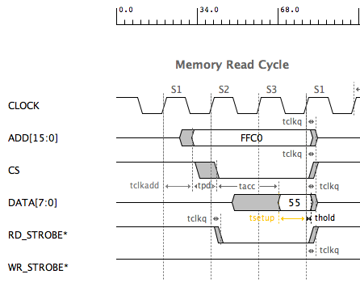

Step by Step Example 
=====================

"

The Timing Diagram Signals
---------------------------------

===========  =====   ==========   ==========   ===========   ======
Signal Name  Freq    Duty Cycle   Edge Times   Start State   Format
===========  =====   ==========   ==========   ===========   ======
CLOCK        50MHz       50%          2nS           H
ADD[15:0]                             2nS           Z        Hex
CS*                                   2nS           H   
DATA[7:0]                             2nS           Z        Hex
RD_STROBE*                            2nS           H
WR_STROBE*                            2nS           H
===========  =====   ==========   ==========   ===========   ======

The Part Delays 
----------------

=======  ==== ==== ==== ======================
Delays   Min  Typ  Max  Description
=======  ==== ==== ==== ======================
tclkadd  7nS  10nS 12nS Add gen prop delay
tpd      7nS  10nS 12nS Comb prop delay
tacc     15nS 20nS 25nS Mem access time delay
tclk2q   2nS  3nS  4nS  Reg clk2Q delay
=======  ==== ==== ==== ======================

The Part Constraints 
----------------

===========   ==== ==== ==== =================
Constraints   Min  Typ  Max  Description
===========   ==== ==== ==== =================
tsetup        12nS 12nS 12nS Mem setup time
thold         1nS  1nS  1nS  Mem hold time
===========   ==== ==== ==== =================

Start a New Timing Diagram
----------------------------

* To start a diagram, File Menu -> New or Ctrl-n

    #. Start a new timing diagram.

Add the Part Delays and Constraints
--------------------------------------------

* To add a Part Delay, Libs Menu -> Part Delay or Shft-1.
* To add a Part Constraint, Libs Menu -> Part Constraint or Shft-2.

    #. Add the Delays shown above.
    #. Add the Constraints shown above.

Adding the Signals
--------------------

* To add a Clock, Add Menu -> Clock or Ctrl-1
* To add a Signal, Add Menu -> Signal or Ctrl-2
* To add a Bus, Add Menu -> Bus or Ctrl-3

    #. Add Clock CLOCK.
    #. Add Bus ADD.
    #. Add Signal CS*.
    #. Add Bus DATA.
    #. Add Signal RD_STROBE*.
    #. Add Signal WR_STROBE*.

Adding the Pulses to the Signals
---------------------------------

* To enable "Add Pulse" mode,  click on AP button. Button background color turns dark.
* To disable "Add Pulse" mode,  click on AP button. Button background color turns light.

    #. Enable "Add Pulse" mode. 
    #. Set “Auto Increment” in toolbar to 0.  
    #. Set signal value in toolbar to FFC0.
    #. Click in ADD bus at 30ns,50ns, and 70nS. This will make a FFC0 pulse for
       3 clock cycles.
    #. Select “L”. Click in CS* at 50nS and 70nS. This will make a low pulse 
       for 2 clock cycles.
    #. Change signal value to 55. Click in DATA bus at 70nS. This will make a
       55 pulse for 1 clock cycle.
    #. Select “L”. Click in RD_STROBE* at 70nS. This will make a low pulse for 1 
       clock cycle.
    #. Disable "Add Pulse" mode. 

Adding the Delays and Constraints
-----------------------------------

* To add a Delay, Add Menu -> Delay or Ctrl-7 or right button click for pop-up menu
* To add a Constraint, Add Menu -> Constraint or Ctrl-8 or right button click for pop-up menu

You can quickly add previously used Delays or Constraints. Use the pop-up menu selections

* To add a previously used Delay, right button click for pop-up menu 
  and select "Add Used Delay".  
* To add a previously used Constraint, right button click for pop-up menu 
  and select "Add Used Constraint".

    #. Select 1st rising edge of CLOCK and 1st edge of ADD.  Add delay tclk2add.
    #. Select 1st edge of ADD and 1st edge of CS*. Add delay tpd.
    #. Select 1st edge of CS* and 1st edge of DATA. Add delay tacc.
    #. Select 1st edge of DATA and 4th rising edge of CLOCK.
    #. Add Constraint. Select Max-Min Type. Add constraint tsetup.
    #. Select 4th rising edge of CLOCK and 2nd edge of ADD. Add delay tclk2q.
    #. Select 4th rising edge of CLOCK and 2nd edge of CS*. Add previously used delay tclk2q 
    #. Select 4th rising edge of CLOCK and 2nd edge of DATA. Add previoulsy used delay tclk2q
    #. Select 4th rising edge of CLOCK and 2nd edge of DATA. Select Max-Min.  Add constraint thold. 
    #. Select 4th rising edge of CLOCK and 2nd edge of RD_STROBE*. Add delay tclk2q
    #. Click in delay and contraint labels in diagram and then use the arrow key
       combinations to position the labels.

Adding the StateBars
------------------------

* To add a StateBar, Add Menu -> StateBar or Ctrl-4

    #. Select 1st rising edge of CLOCK. Add StateBar S1 using dialog.
    #. Select 2nd rising edge of CLOCK. Add StateBar S2 using dialog already open.
    #. Select 3nd rising edge of CLOCK. Add StateBar S3 using dialog already open.
    #. Select 4nd rising edge of CLOCK. Add StateBar S1 using dialog already open.

Timing Analysis
-----------------

You could increase the CLOCK frequency or change any of the delays to quickly
check for constraint violations. This will indicate problems with 
fast clock rates or slower parts. Drag a Delay or Constraint edge to 
see the results immediately.

